# (期末考核） 基于Oracle的员工管理系统系统数据库设计

# 1.项目简介

项目名称：员工管理系统

本项目是基于Oracle的员工管理系统数据库设计。

涉及角色/用户：管理员、普通用户

涉及表：员工表、部门表、职位表、项目表、薪资表


# 2.功能分析

## 2.1员工管理功能

员工管理功能，是由管理员进行的，主要包含员工查询、员工增加、员工修改、员工删除，主要通过操作数据库来实现这些操作。


## 2.2部门管理功能

部门管理功能，是由管理员进行的，主要包含部门查询、部门增加、部门修改、部门删除，主要通过操作数据库来实现这些操作。


## 2.3职位管理功能

职位管理功能主要指两个方面，主要包含职位管查询、职位管增加、职位管修改、职位管删除，主要通过操作数据库来实现这些操作。


## 2.4项目管理功能

项目管理能，是由管理员进行的，主要包含查看项目，修改项目起止时间、删除项目，创建项目等。主要通过操作数据库来实现这些操作。


## 2.5薪资管理功能

薪资管理功能，是由管理员进行的，主要包含薪资查询、薪资结算、薪资修改，主要通过从数据库匹配关键信息来实现这些操作。


# 3.项目设计

项目主要包括数据结构设计，存储过程设计，备份恢复设计等。


# 4.数据库设计

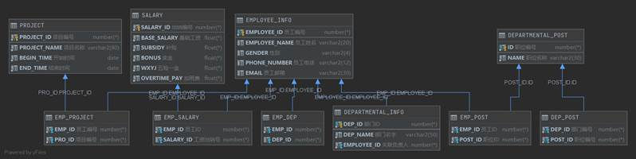

 

## 4.1 EMPLOYEE_INFO表（员工表）

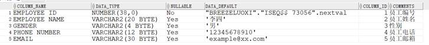

 


## 4.2 DEPARTMENTAL_INFO表（部门表）

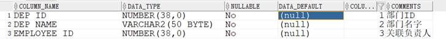


## 4.3 DEPARTMENTAL_POST表（职位表）


## 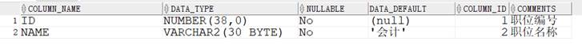4.4 PROJECT表（项目表）

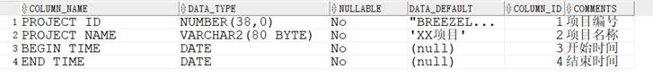


## 4.5 SALARY表（薪资表）


## 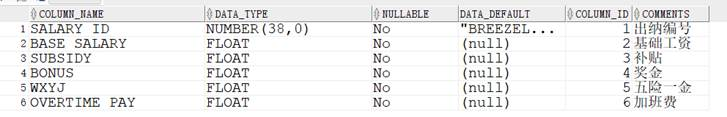5.设计项目涉及的表及表空间使用方案，并插入总共十万条数据

## 5.1设计简介

创建表空间：

表空间总共三个：breeze_users，breeze_users1

模型中包含五个实体，实体名称以及属性如下：

 

员工信息表：员工编号、员工姓名、身份证号、性别、手机号、邮箱；

 

公司部门表：部门编号、部门名称、负责人工号；

 

部门职位表：职位编号、职位名称；

 

项目表：项目编号、项目名称、开启时间、结束时间；

 

工资表：出纳编号、基本工资、五险一金、绩效奖金、补贴、加班费。

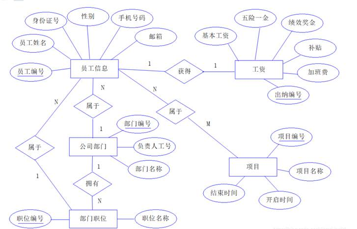

分区策略：

hash分区（散列）

散列分区为通过指定分区编号来均匀分布数据的一种分区类型，因为通过在I/O设备上进行散列分区，使得这些分区大小一致。如将物料交易表的数据根据交易ID散列地存放在指定的三个表空间中。

## 5.2创建表空间

### 5.2.1代码部分

-- 创建表空间breeze_users

```sql
 CREATE TABLESPACE breeze_users DATAFILE

'P:/Breeze/program/oradata/BREEZE/breeze_users_1.dbf'

 SIZE 100M AUTOEXTEND ON NEXT 50M MAXSIZE UNLIMITED，

'P:/Breeze/program/oradata/BREEZE/breeze_users_2.dbf' 

 SIZE 100M AUTOEXTEND ON NEXT 50M MAXSIZE UNLIMITED

EXTENT MANAGEMENT LOCAL SEGMENT SPACE MANAGEMENT AUTO;
```


 

创建表空间breeze_users1

```sql
CREATE TABLESPACE breeze_users1 DATAFILE

'P:/Breeze/program/oradata/BREEZE/breeze_users01_1.dbf'

 SIZE 100M AUTOEXTEND ON NEXT 50M MAXSIZE UNLIMITED，

'P:/Breeze/program/oradata/BREEZE/breeze_users01_2.dbf' 

 SIZE 100M AUTOEXTEND ON NEXT 50M MAXSIZE UNLIMITED

EXTENT MANAGEMENT LOCAL SEGMENT SPACE MANAGEMENT AUTO;
```


### 5.2.2截图部分


## 5.3创建表

### 5.3.1代码部分

-- EMPLOYEE_INFO表的创建

-- auto-generated definition

```sql
create table EMPLOYEE_INFO

(

  EMPLOYEE_ID  NUMBER    default "BREEZELUOXI"."ISEQ$$_73056".nextval generated as identity

​    constraint EMPLOYEE_INFO_PK

​    primary key,

  EMPLOYEE_NAME VARCHAR2(20) default '李四',

  GENDER    VARCHAR2(4) default '男',

  PHONE_NUMBER VARCHAR2(12) default '12345678910',

  EMAIL     VARCHAR2(30) default 'example@xx.com'

)

/

 

comment on table EMPLOYEE_INFO is '员工信息表'

/

 

comment on column EMPLOYEE_INFO.EMPLOYEE_ID is '员工编号'

/

 

comment on column EMPLOYEE_INFO.EMPLOYEE_NAME is '员工姓名'

/

 

comment on column EMPLOYEE_INFO.GENDER is '性别'

/

 

comment on column EMPLOYEE_INFO.PHONE_NUMBER is '员工电话'

/

 

comment on column EMPLOYEE_INFO.EMAIL is '员工邮箱'

/
```


-- DEPARTMENTAL_INFO 表创建

```sql
create table DEPARTMENTAL_INFO

(

  DEP_ID   NUMBER    default "BREEZELUOXI"."ISEQ$$_73059".nextval generated as identity

​    constraint DEPARTMENTAL_INFO_PK

​    primary key,

  DEP_NAME  VARCHAR2(30) default 'XX部门',

  EMPLOYEE_ID NUMBER not null

​    constraint DEP_EMPLOYEE

​      references EMPLOYEE_INFO

)

/

 

comment on table DEPARTMENTAL_INFO is '部门信息表'

/

 

comment on column DEPARTMENTAL_INFO.DEP_ID is '部门编号'

/

 

comment on column DEPARTMENTAL_INFO.DEP_NAME is '部门名称'

/

 

comment on column DEPARTMENTAL_INFO.EMPLOYEE_ID is '负责人工号'

/

 
```


-- DEPARTMENTAL_POST 表创建

```sql
create table DEPARTMENTAL_POST

(

  ID  NUMBER          not null

​    constraint DEPARTMENTAL_POST_PK

​      primary key,

  NAME VARCHAR2(30) default '会计' not null

)

/

 

comment on table DEPARTMENTAL_POST is '部门职位'

/

 

comment on column DEPARTMENTAL_POST.ID is '职位编号'

/

 

comment on column DEPARTMENTAL_POST.NAME is '职位名称'

/

 
```


-- PROJECT 表创建

```sql
create table PROJECT

(

  PROJECT_ID  NUMBER    default "BREEZELUOXI"."ISEQ$$_73067".nextval generated as identity

​    constraint PROJECT_PK

​    primary key,

  PROJECT_NAME VARCHAR2(80) default 'XX项目' not null,

  BEGIN_TIME  DATE            not null,

  END_TIME   DATE            not null

)

/

 

comment on table PROJECT is '项目'

/

 

comment on column PROJECT.PROJECT_ID is '项目编号'

/

 

comment on column PROJECT.PROJECT_NAME is '项目名称'

/

 

comment on column PROJECT.BEGIN_TIME is '开始时间'

/

 

comment on column PROJECT.END_TIME is '结束时间'

/
```


-- SALARY 表创建

```sql
create table SALARY

(

  SALARY_ID  NUMBER generated as identity

​    constraint SALARY_PK

​      primary key,

  BASE_SALARY FLOAT not null,

  SUBSIDY   FLOAT not null,

  BONUS    FLOAT not null,

  WXYJ     FLOAT not null,

  OVERTIME_PAY FLOAT not null

)
comment on table SALARY is '工资'

/

 

comment on column SALARY.SALARY_ID is '出纳编号'

/

 

comment on column SALARY.BASE_SALARY is '基础工资'

/

 

comment on column SALARY.SUBSIDY is '补贴'

/

 

comment on column SALARY.BONUS is '奖金'

/

 

comment on column SALARY.WXYJ is '五险一金'

/

 

comment on column SALARY.OVERTIME_PAY is '加班费'

/
```


### 5.3.2截图部分

## 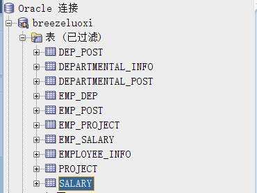

## 5.4插入数据

### 5.4.1存储过程设计

l SAVE_TO_DEPARTMENTAL_POST, 

存入部门职位表

l SAVE_TO_EMP_DEP, 

存入员工部门表

l SAVE_TO_EMP_POST, 

存入员工职位表

l SAVE_TO_EMP_PROJECT, 

存入员工项目表

l SAVE_TO_EMP_SALARY, 

存入员工薪资表

l SAVE_TO_EMPLOYEE_INFO

存入员工表

l SQVE_TO_PROJECT,

存入工程项目总表

l SQVE_TO_SALARY

存入薪资总表

### 5.4.2代码部分

l SAVE_TO_DEPARTMENTAL_POST, 

```sql
create or replace PROCEDURE save_to_DEPARTMENTAL_POST
AS
    v_name VARCHAR2(50);
BEGIN
  for i in 1..20
    loop
        v_name := '职位'||i||'号';
        insert into DEPARTMENTAL_POST (ID,NAME) VALUES (i,v_name);
    end loop;
END SAVE_TO_DEPARTMENTAL_POST;
```


l SAVE_TO_EMP_DEP, 

```sql
create or replace procedure save_to_EMP_DEP(
    emp_length in NUMBER
)
AS
    cursor c_test is select EMPLOYEE_ID from EMPLOYEE_INFO; --声明显式EMPLOYEE_INFO表中游标
    -- 定义EMPLOYEE_ID
    v_EMP_id EMPLOYEE_INFO.EMPLOYEE_ID%type;
    v_index NUMBER;
begin DBMS_OUTPUT.ENABLE(buffer_size => null);
    --打开游标
    open c_test;
    -- 遍历游标
    LOOP
        FETCH c_test into v_EMP_id;
        -- 退出条件
        exit when c_test%NOTFOUND;
        -- 生成随机index
        SELECT trunc(dbms_random.value(1,emp_length+1))into v_index FROM DUAL;  
        -- 打印信息
        DBMS_OUTPUT.PUT_LINE('hello,emp_id = '||v_EMP_id||' DEP_ID = '|| v_index);
        -- 执行语句
        insert into EMP_DEP (EMP_ID, DEP_ID) values (v_EMP_id,v_index);
    end loop;
    --关闭游标
    close c_test;
end save_to_EMP_DEP;
```


l SAVE_TO_EMP_POST, 

```sql
CREATE OR REPLACE PROCEDURE SAVE_TO_EMP_POST(
    post_length in NUMBER
)
AS 
    cursor c_test is select EMPLOYEE_ID from EMPLOYEE_INFO; --声明显式EMPLOYEE_INFO表中游标
    -- 定义EMPLOYEE_ID
    v_EMP_id EMPLOYEE_INFO.EMPLOYEE_ID%type;
    v_index NUMBER;
BEGIN
   --打开游标
    open c_test;
    -- 遍历游标
    LOOP
        FETCH c_test into v_EMP_id;
        -- 退出条件
        exit when c_test%NOTFOUND;
        -- 生成随机index
        SELECT trunc(dbms_random.value(1,post_length+1))into v_index FROM DUAL;  
        -- 打印信息
        DBMS_OUTPUT.PUT_LINE('hello,emp_id = '||v_EMP_id||' POST_ID = '|| v_index);
        -- 执行语句
        insert into EMP_POST (EMP_ID, POST_ID) values (v_EMP_id,v_index);
    end loop;
    --关闭游标
    close c_test;
END SAVE_TO_EMP_POST;
```


l SAVE_TO_EMP_PROJECT, 

```sql
CREATE OR REPLACE PROCEDURE SAVE_TO_EMP_PROJECT AS 
    -- 声明显式EMPLOYEE_INFO表中游标
    cursor c_test is select EMPLOYEE_ID from EMPLOYEE_INFO;
    -- 员工表中的ID
    v_EMP_id EMPLOYEE_INFO.EMPLOYEE_ID%type;
    -- 显示申明PROJECT 表中的游标
    cursor c_project is select PROJECT_ID from PROJECT;
    -- 项目表中的ID
    v_PROJECT_id PROJECT.PROJECT_ID%type;
BEGIN
    -- 开启游标
    open c_test;
    open c_project;
    -- 开启循环
    loop
        -- 取值
        FETCH c_test into v_EMP_id;
        FETCH c_project into v_PROJECT_id;
        -- 退出
        exit when c_test%NOTFOUND or c_project%NOTFOUND;
        insert into EMP_PROJECT (EMP_ID,PRO_ID) VALUES (v_EMP_id,v_PROJECT_id);
    end loop;
    -- 关闭游标
    close c_test;
    close c_project;
END SAVE_TO_EMP_PROJECT;
```


l SAVE_TO_EMP_SALARY, 

```sql
CREATE OR REPLACE PROCEDURE SAVE_TO_EMP_SALARY(
    month_count IN number
)
AS 
    -- 声明显式EMPLOYEE_INFO表中游标
    cursor c_test is select EMPLOYEE_ID from EMPLOYEE_INFO;
    -- 声明显式SALARY表中游标
    cursor c_salary is select SALARY_ID from SALARY;
    -- 员工ID
    v_EMP_id EMPLOYEE_INFO.EMPLOYEE_ID%type;
    -- 工资单ID
    v_SALARY_id SALARY.SALARY_ID%type;
BEGIN
    DBMS_OUTPUT.ENABLE(buffer_size => null);
    --打开游标
    open c_test ;
    open c_salary;
    
    -- 遍历员工ID
    loop 
        FETCH c_test into v_EMP_id;
        -- 退出条件
        exit when c_test%NOTFOUND;
        for i in 1..month_count
        loop
            FETCH c_salary into v_SALARY_id;
            exit when c_salary%NOTFOUND;
            DBMS_OUTPUT.PUT_LINE('开始了empID = ' || v_EMP_id || 'POST_ID = '|| v_salary_id);
            insert into EMP_SALARY (EMP_ID,SALARY_ID) VALUES (v_EMP_id,v_salary_id);
        end loop;
    end loop;
    -- 关闭游标
    close c_test;
    close c_salary;
END SAVE_TO_EMP_SALARY;
```


l SAVE_TO_EMPLOYEE_INFO

```sql
create or replace PROCEDURE save_to_EMPLOYEE_INFO
AS
    v_name varchar(50);
    v_gender varchar(4);
    v_phone varchar(12);
    v_email varchar(30);
begin
    for i in 1..10000
        loop
            v_name := '张三' || i || '号';
            v_gender := '男';
            v_phone := '135' || i;
            v_email := 'example@qq.com';
            insert into BREEZELUOXI.EMPLOYEE_INFO (EMPLOYEE_NAME,GENDER,PHONE_NUMBER,EMAIL) values (v_name,v_gender,v_phone,v_email);
        end loop;
end;
```


l SQVE_TO_PROJECT,

```sql
CREATE OR REPLACE PROCEDURE SQVE_TO_PROJECT AS
    -- 声明显式EMPLOYEE_INFO表中游标
    cursor c_test is select EMPLOYEE_ID from EMPLOYEE_INFO;
    -- 员工ID
    v_EMP_id EMPLOYEE_INFO.EMPLOYEE_ID%type;
    -- 项目名称
    v_PROJECT_NAME PROJECT.PROJECT_NAME%type;
    -- 项目开始时间
    v_BEGIN_TIME PROJECT.BEGIN_TIME%type;
    -- 项目结束时间
    v_END_TIME PROJECT.END_TIME%type;
BEGIN
    DBMS_OUTPUT.ENABLE(buffer_size => null);
    -- 打开游标
    open c_test;
    -- 循环遍历
    loop 
        -- 取值
        FETCH c_test into v_EMP_id;
        -- 是否退出
        EXIT WHEN c_test%NOTFOUND;
        DBMS_OUTPUT.PUT_LINE('开始插入数据'||v_EMP_id||'号');
        -- 插入数据操作
        -- 初始化数据
        v_PROJECT_NAME := '项目'||v_EMP_id||'号';
        v_BEGIN_TIME := TO_DATE(sysdate);
        v_END_TIME := TO_DATE(sysdate + 6000);     
        DBMS_OUTPUT.PUT_LINE('插入数据项目名 = '||v_PROJECT_NAME||'项目开始时间 = '||v_begin_time||'项目结束时间 = '|| v_end_time);
        insert into PROJECT (PROJECT_NAME,BEGIN_TIME,END_TIME)
        VALUES (v_PROJECT_NAME,v_BEGIN_TIME,v_END_TIME);
      end loop;
    -- 关闭游标
    close c_test;
END SQVE_TO_PROJECT;
```


l SQVE_TO_SALARY

```sql
CREATE OR REPLACE PROCEDURE SQVE_TO_SALARY(
    month_count in number
) AS 
    -- 声明显式EMPLOYEE_INFO表中游标
    cursor c_test is select EMPLOYEE_ID from EMPLOYEE_INFO;
    v_EMP_id number;
    -- 基础工资
    v_BASE_SALARY SALARY.BASE_SALARY%type;
    -- 补贴
    v_SUBSIDY SALARY.SUBSIDY%type;
    -- 津贴
    v_BONUS SALARY.BONUS%type;
    -- 五险一金
    v_WXYJ SALARY.WXYJ%type;
    -- 加班工资
    v_OVERTIME_PAY SALARY.OVERTIME_PAY%type;
BEGIN
    DBMS_OUTPUT.ENABLE(buffer_size => null);
     --打开游标
    open c_test;
    -- 遍历游标
    LOOP
        FETCH c_test into v_EMP_id;
        -- 退出条件
        exit when c_test%NOTFOUND;
        DBMS_OUTPUT.PUT_LINE ('开始存储第'||v_EMP_id||'号员工的工资单');
       for i in 1..month_count
        loop
            v_BASE_SALARY := 6000.0 + i*100.50;  -- 6000底薪 + 月份*100
            v_SUBSIDY := 600.85;    -- 补贴
            v_BONUS := 800;      -- 津贴
            v_WXYJ := i*150.65;     -- 五险一金
            -- 生成随机加班工资
            SELECT trunc(dbms_random.value(10,500))into v_OVERTIME_PAY FROM DUAL;
            INSERT into SALARY (BASE_SALARY,SUBSIDY,BONUS,WXYJ,OVERTIME_PAY) VALUES 
            (v_BASE_SALARY,v_SUBSIDY,v_BONUS,v_WXYJ,v_OVERTIME_PAY);
            DBMS_OUTPUT.PUT_LINE ('存入'||v_BASE_SALARY||v_SUBSIDY||v_BONUS||v_WXYJ||v_OVERTIME_PAY);
        end loop;
    end loop;
    --关闭游标
    close c_test;
END SQVE_TO_SALARY;
```


 

### 5.4.3截图部分

验证数据是否插入成功：

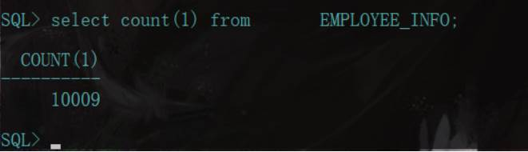

 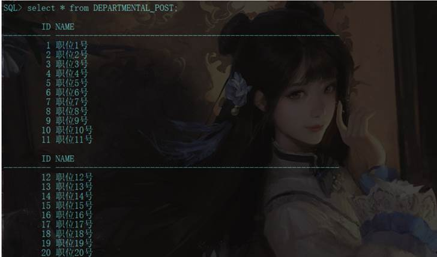

 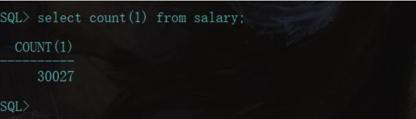 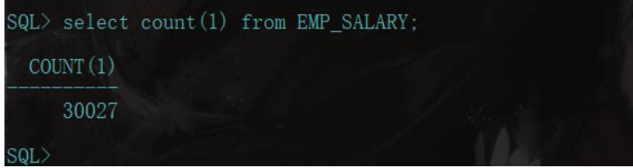 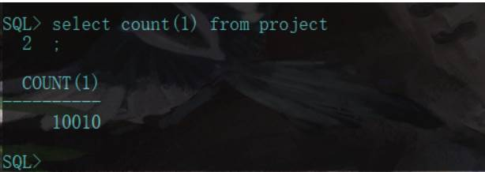


# 6.设计权限及用户分配方案,两类角色，两个用户

## 6.1设计简介

用户：

Breezeluoxi

拥有角色：db_manager 

分配表空间：breeze_users，breeze_users1

Breezeluoxi1

拥有角色：db_reader

分配表空间：breeze_users，breeze_users1

角色：

db_manager

拥有角色：connect、resource、dba

db_reader

拥有角色：connect、resource

## 6.2代码部分

-- 创建角色 
 \# 角色1

```sql
CREATE ROLE db_manager IDENTIFIED BY pujingmin3344;
```


\# 角色2

```sql
CREATE ROLE db_reader IDENTIFIED BY 123456;
```

 -- 授权角色 

```sql
grant create SESSION to db_reader;

GRANT CREATE SESSION，CREATE TABLE,CREATE SEQUENCE，CREATE VIEW to db_manager;
```


 -- 创建用户 

```sql
 create user breezeluoxi identified by 123
```

 -- 指定用户额外表空间 

```sql
 alter user breezeluoxi quota unlimited on breeze_users;

alter user breezeluoxi quota unlimited on breeze_users1;
```

 -- 创建用户 

```sql
 create user breezeluoxi1 identified by 123456;
```


-- 指定用户额外表空间 

```sql
 alter user breezeluoxi1 quota unlimited on breeze_users;
```

 -- 分配角色给用户 

```sql
 grant db_manager to breezeluoxi;
 grant db_reader to breezeluoxi1;
```


## 6.3截图部分

成功截图如下：

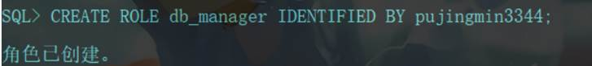  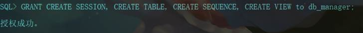 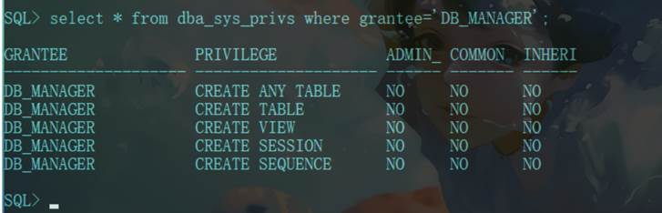 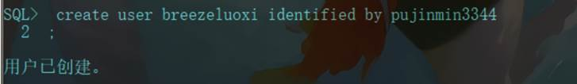   


# 7.在数据库中建立一个程序包，在包中用PL/SQL语言设计一些存储过程和函数，实现比较复杂的业务逻辑，用模拟数据进行执行计划分析

## 7.1设计简介

建立的包：

包名：Work

函数：

函数名：get_employee(employee_id number)

功能：

输入员工ID，查询员工信息，所属部门，职位，薪水，参与项目

过程：

过程名：Get_employee(employee_id number)

 

功能：

输入员工ID，查询员工信息，所属部门，职位，薪水，参与项目

## 7.2代码与截图

-- 创建包

```sql
 create or replace PACKAGE TrainPack IS
  FUNCTION Get_count(order_id_t NUMBER) RETURN VARCHAR2;
  PROCEDURE Get_orders(train_id_t VARCHAR2);
 END TrainPack;
```

 -- 创建函数和过程

```sql
 create or replace PACKAGE BODY MY_WORK IS

  FUNCTION get_employee(employee_id number) RETURN VARCHAR2

  AS

   M VARCHAR2(100);

   BEGIN

​    select EMPLOYEE_NAME into N from EMPLOYEE_INFO where EMPLOYEE_ID=employee_id;

​    RETURN N;

   END;

  PROCEDURE get_employeeinfo(employee_id number)

  AS

​    v_EMPLOYEE_name employee_info.employee_name%type;

​    v_DEPARTMENTAL_name DEPARTMENTAL_INFO.DEP_NAME%type;

​    v_DEP_id emp_dep.dep_id%type;

​    v_DEPARTMENTAL_POST_name departmental_post.name%type;

​    v_PROJECT_name project.project_name%TYPE;

​    v_SALARY salary.base_salary%TYPE;

  begin

​    DBMS_OUTPUT.ENABLE(buffer_size => null);

​    --使用游标

​    DBMS_OUTPUT.PUT_LINE('输出员工信息：');

​    select EMPLOYEE_NAME into v_EMPLOYEE_name from EMPLOYEE_INFO where EMPLOYEE_ID = employee_id;

​    select DEP_ID into v_DEP_id from EMP_DEP where EMP_DEP.EMP_ID= employee_id;

​    select DEP_NAME into v_DEPARTMENTAL_name from DEPARTMENTAL_INFO where DEP_ID = v_DEP_id;

​    select name into v_DEPARTMENTAL_POST_name from DEPARTMENTAL_POST where ID = (select POST_ID from EMP_POST where EMP_POST.EMP_ID=employee_id);

​    select project_name into v_PROJECT_name from PROJECT where PROJECT_ID = (select PRO_ID from EMP_PROJECT where EMP_PROJECT.EMP_ID=employee_id);

​    select base_salary into v_SALARY from SALARY where SALARY_ID = (select SALARY_ID from EMP_SALARY where EMP_SALARY.EMP_ID=employee_id and rownum=1 );

​    DBMS_OUTPUT.PUT_LINE('员工姓名：'||v_EMPLOYEE_name||

​    '员工部门:'||v_departmental_name||

​    '员工职位：'||v_departmental_post_name||

​    '员工参与项目：'||v_project_name||

​    '员工薪资：'||v_salary);

  END;

END TrainPack; /
```


测试：

 

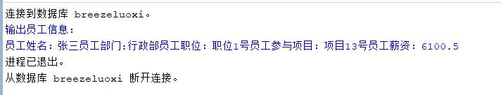


# 8.设计手动备份方案

## 8.1设计简介

手动备份方案——脱机备份

自动备份方案——用户管理备份

## 8.2实验步骤（手动备份方案）

### 8.2.1概念

同脱机备份一样，用户管理备份也需要复制文件，但过程却完全不同


### 8.2.2步骤

l 查询所有的数据文件、控制文件和联机重做日志文件

```sql
SELECT NAME FROM v$datafile

  UNION ALL

  SELECT MEMBER as NAME FROM v$logfile

  UNION ALL

SELECT NAME FROM v$controlfile；
```


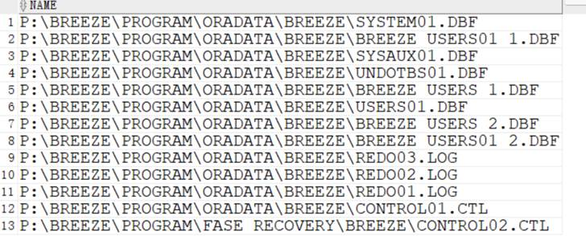

l 停机恢复

将手动备份的文件复制到原来的目录中重启数据库（startup）即可


### 8.3实验步骤（联机自动备份） 


### 8.3.1概述

同脱机备份一样，用户管理备份也需要复制文件，但过程却完全不同

### 8.3.2步骤

1.让表空间进入备份模式

​    ALTER TABLESPACE *** BEGIN BACKUP

2.复制表空间文件

3.让表空间结束备份模式

​    ALTER TABLESPACE *** END BACKUP

4.复制控制文件和初始化文件

5.临时停止归档

  ALTER SYSTEM SWITCH LOGFILE;

  ALTER SYSTEM ARCHIVE LOG STOP;

6.复制归档日志文件

7.重新开启归档

​    ALTER SYSTEM ARCHIVE LOG START;

### 8.3.3实际操作 

l 以sys 用户登录


l 查询表空间的数据文件

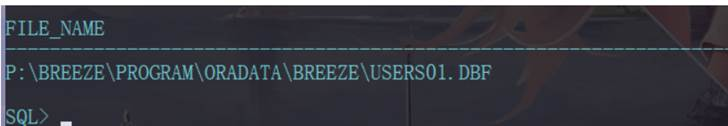

l 进入备份模式

1. 查看归档模式archive log list;


2. 以archive模式启动数据库

```sql
shutdown immediate

startup mount

alter database archivelog;
```


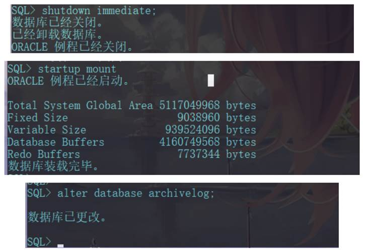

3. 再次查看归档模式

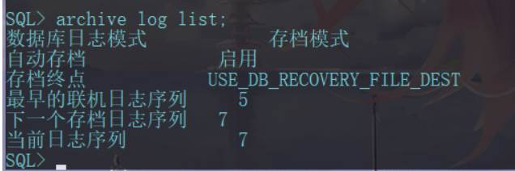

4. alter database open;


5. 转存数据库文件

```sql
!cp P:\BREEZE\PROGRAM\ORADATA\BREEZE\USERS01.DBF C:\Users\breez\Oracle\data\USERS01.DBF
```


6. 结束备份

```sql
ALTER tablespace users begin backup;
```


# 9.项目总结

 完成本次期末项目我收获很多，对于Oracle数据库管理的方式，角色，对象，数据库他们的特性及意义有了自己的认识，明白了项目管理，数据库维护过程中对于用户的角色的限制是必要的，我们要做的就是在自己的职能范围之下完成自己的工作。

 本次项目完成后，我对于oralce数据库操作有了一个全新的认识，oralce数据库的游标，存储过程，备份与恢复，等等功能，有了清晰的认识。收获最大的还是对于存储过程的学习，以及数据库备份功能的实现，明白了官方极力推崇存储过程的原因，另外对于数据备份与恢复我也有了自己的认识，备份与恢复是数据库管理中最重要的方面之一。如果数据库崩溃却没有办法恢复它，那么对企业造成的毁灭性结果可能会是数据丢失、收入减少、客户不满等。在任何情况下，无论数据库服务器有多稳定，可靠，我们都需要制订一个备份与恢复方案来备份重要数据并使自身免于灾难。

 项目完成后我的一个解决问题的能力有了很大的提升也对于自己的不足有了清晰的认识，今后我会在好的地方继续发扬光大，不足的地方努力改正。

 

 